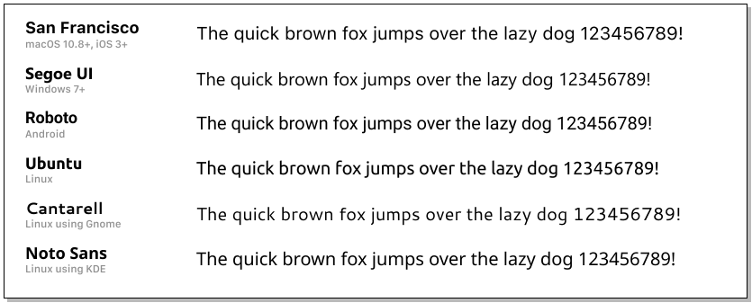

# Milestone 4: Airsoft Tactical Supply
## Rationale
This website is designed to provide a seamless and secure shopping experience for airsoft enthusiasts. It aims to cater to both casual shoppers and registered users, offering a wide range of airsoft rifles and related products.

For viewing and navigation, the website provides a clear list of products and categories, allowing users to quickly find the products they're interested in. Detailed product information, including price, description, and specifications, are readily available. Users can also view their total purchases at any time to manage their spending.

The website also offers registration and user account functionalities. Users can register for an account, log in or out, recover their password, and receive email confirmations after registration. Registered users have access to a user profile where they can view their order history and save their payment information.

To further enhance the shopping experience, the website provides sorting and searching features. Users can sort products by price or category, search for products by name or description, and view search results along with the number of results.

The purchasing and checkout process is designed to be straightforward and secure. Users can select product quantities, view items in their cart, adjust quantities of cart items, and enter their payment information securely. After checkout, users can view a confirmation order and receive an email confirmation.

For the store owner, the website provides functionalities to add, edit, or delete products, allowing for efficient store management.

In summary, this website aims to provide a comprehensive, user-friendly, and secure online shopping platform for airsoft rifles and related products.

## Development Plan
Requirements Gathering: Understand the needs of the users and the products that will be sold on the website. This includes details about the airsoft rifles and related products, as well as user information for account creation and order tracking.

Database Design: Design a database schema that accurately represents the products to be sold and the user data to be collected. This will involve defining tables for users, products, and orders, and establishing relationships between them.

User Interface Design: Design a user-friendly interface for users to register, log in, view products, add them to their cart, and checkout. The design should be intuitive and accessible to users of all ages and levels of technical proficiency.

Backend Development: Implement the server-side logic to handle user registration, login, product viewing, cart management, and order checkout. This includes validating and storing the data in the database, managing user sessions, and handling payment processing.

Frontend Development: Implement the client-side logic to interact with the backend, display products to the user, manage the shopping cart, and provide a smooth user experience.

Testing: Conduct thorough testing to ensure the website works as expected and handles edge cases gracefully. This includes testing the user registration, login, product viewing, cart management, and checkout processes.

Deployment: Deploy the website to a production environment and set up any necessary infrastructure, such as a database server and web server.

By following this plan, I can develop a website that meets the needs of both the airsoft enthusiasts who will be shopping on the site and the store owner who will be managing the products.

## User Stories
### Viewing & Navigation
| User Story ID | As a/an | I want to be able to...                         | So that I can |
| ------------- | ------- | ----------------------------------------------- | --------------------------------------------------------------------------------------|
| 1             | Shopper | View a list of products                         | Select purchases |
| 2             | Shopper | View product categories                         | Find products quickly|
| 3             | Shopper | View details & specifications for each product  | Identify price, description, product image, and specifications |
| 4             | Shopper | View the total of my purchases at any time      | Avoid over spending |

### Registration & User Accounts
| User Story ID | As a/an   | I want to be able to...                         | So that I can                                                                           |
| ------------- | --------- | ----------------------------------------------- | --------------------------------------------------------------------------------------- |
| 5             | Site User | Register for an account                         | Have a personal account and view my profile                                             |
| 6             | Site User | Login or logout                                 | Access my personal account information                                                  |
| 7             | Site User | Recover my password                             | Recover access to my account                                                            |
| 8             | Site User | Receive an email confirmation after registering | Verify that my account registration was successful                                      |
| 9             | Site User | Have a user profile                             | View my personal order history and order confirmations, and save my payment information |

### Sorting & Searching
| User Story ID | As a/an | I want to be able to...                             | So that I can                                                                              |
| ------------- | ------- | --------------------------------------------------- | ------------------------------------------------------------------------------------------ |
| 10            | Shopper | Sort the list of available products                 | Identify the best priced and categorically sorted products                                 |
| 11            | Shopper | Sort a specific product category                    | Find the best priced in a specific category, or sort the products in that category by name |
| 12            | Shopper | Sort multiple categories of products simultaneously | Find the best-priced products across broad categories, such as 'rifles', or 'pistols'      |
| 13            | Shopper | Search by product name or description               | Find a specific product I'd like to purchase                                               |
| 14            | Shopper | See search results and the number of results        | Quickly decide whether the product I want is available                                     |

### Purchasing & Checkout
| User Story ID | As a/an | I want to be able to...                                     | So that I can                                       |
| ------------- | ------- | ----------------------------------------------------------- | ----------------------------------------------------|
| 15            | Shopper | Select the product quantity                                 | Ensure I don't accidentally select the options      |
| 16            | Shopper | View the items in my cart                                   | Identify the total cost                             |
| 17            | Shopper | Adjust the quantity of individual cart items                | Make changes to my purchase(s) before checkout      |
| 18            | Shopper | Enter my payment information                                | Check out without issue                             |
| 19            | Shopper | Feel my personal and payment information is safe and secure | Provide the required information to make a purchase |
| 20            | Shopper | View a confirmation order                                   | Verify that the information is correct              |
| 21            | Shopper | Receive an email confirmation once checkout is complete     | Maintain a record                                   |

### Admin & Store Management
| User Story ID | As a/an     | I want to be able to... | So that I can              |
| ------------- | ----------- | ----------------------- | ---------------------------|
| 22            | Store Owner | Add products            | Add new items              |
| 23            | Store Owner | Edit/Update a product   | Change product information |
| 24            | Store Owner | Delete a product        | Remove items               |

## Features
- Home Page: An introductory page with featured products and categories. This addresses the need to understand the site's purpose and see a selection of products immediately.
- Product Viewing Page: A page where users can view all available products, addressing the need to browse the inventory.
- Product Detail Page: A page where users can view detailed information about a specific product, addressing the need to learn more about a product before purchasing.
- Cart Page: A page where users can view the items in their cart, adjust quantities, and proceed to checkout, addressing the need to manage their intended purchases.
- Checkout Page: A page where users can enter their payment information and complete their purchase, addressing the need to securely pay for their selected items.
- Account Registration Page: A page where users can register for an account, addressing the need for users to create their own accounts.
- Login Page: A page where users can log in to their accounts, addressing the need for users to access their accounts.
- Logout Functionality: A feature allowing users to log out of their accounts, addressing the need for users to securely end their sessions.
- Search Functionality: A feature allowing users to search for products by name or description, addressing the need to find specific products quickly.
- Product Sorting Functionality: A feature allowing users to sort products by price or category, addressing the need to organize the product view based on personal preferences.
- Admin Product Management Page: A page where the store owner can add, edit, or delete products, addressing the need for efficient store management.
- Confirmation Alerts: Alerts that confirm when a user has registered, logged in, added items to their cart, or completed a purchase.
- Email Confirmations: Emails sent to users after they register or complete a purchase, providing a record of these actions.

## Database & Models
### Checkout models
### Products models

## Styling
### Fonts
System fonts:
- system-ui, -apple-system, BlinkMacSystemFont, "Segoe UI", Roboto, sans-serif;

Pros:
- User does not need to download the font.
- No need to self host.
- [Fast](https://www.cloudflare.com/en-gb/learning/performance/more/website-performance-conversion-rates/).
- [Avoid GDPR issues](https://www.cookieyes.com/documentation/google-fonts-and-gdpr/#:~:text=According%20to%20GDPR%2C%20an%20IP,party%20services%20without%20user%20consent.)

Cons:
- Not as unique.

## Technology
- HTML
- CSS
[- Bootstrap](https://getbootstrap.com/)
- JavaScript
- Python
[- Django](https://www.djangoproject.com/)

## Resources
- [Unsplash](https://unsplash.com)
- [Kevin Powell: These font stacks will improve your site performance](https://www.youtube.com/watch?v=VOd6jfAImV4)
- Code Institute
- [Boutique Ado](https://github.com/Code-Institute-Solutions/boutique_ado_v1/tree/e3c29afef63a8e5a8dae3fdc6b1277eb32206dbc/media)
- [Land Warrior Airsoft](https://www.landwarriorairsoft.com/)
- [Airsoftdirect.uk.com](https://airsoftdirect.uk.com/)
- [Code Institute Python Linter](https://pep8ci.herokuapp.com/)
- [Django](https://docs.djangoproject.com/en/3.2)
- [miniWebtool django secret key generator](https://miniwebtool.com/django-secret-key-generator/)

## Deployment & Local Development
VSCode and Github Desktop were used for local development and pushing code to GitHub.
### GitHub
### Steps for Forking the Github Repository
1. Log into GitHub.
2. Go to the Kartilo repository.
3. Select the 'Fork' button in the top right corner under your profile icon.
### Steps for Making a Local Clone
1. Log into GitHub.
2. Navigate to the repository you want to clone.
3. Select the '<> Code' and copy the link for your preferred method of cloning the site.
4. Use your terminal to navigate to the working directory you want use.
5. Type git clone into the terminal and paste the link you copied in step 3 and press enter.
### Database: Elephant SQL
1. Log/sign into Elephant SQL.
2. Create a new team.
3. Create new instance.
4. Select your required plan.
5. Select your region/closest data center.
6. Review your details and create the instance.
7. Return to the dashboard, click the database instance you have created, and store the database URL.
### Heroku
1. Login into Heroku.
2. Create and name a new app.
3. Enter settings, reveal and populate the config vars.
4. Click Deploy and select a deployment method of your choosing.
5. Click 'More' and run the console.
6. Type 'python' in the console and click 'run'.
7. Enter the following into the termainl.
   - from <yourappname> import app, db
   - app.app_context().push()
   - db.create_all()
8. Exit the terminals with 'exit()'.
9. Click 'Open app' to view your app.